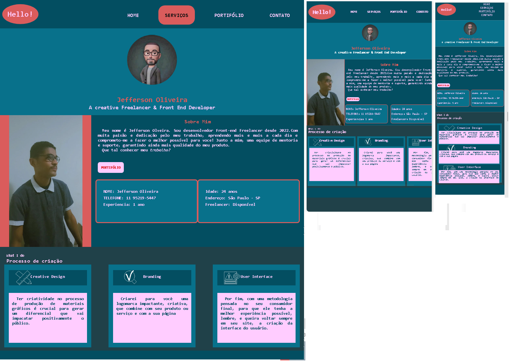

# Projeto Site Portifólio
Página de portifólio simples, com informaçoes de contatos e método de desenvolvimento.

## Tecnologias Utilizadas
- Html
- Css

## Prints do projeto

[]

### Descrição detalhada.
Este projeto foi desenvolvido com a finalidade de exibir informações de contato, como meio de divulgação do meu trabalho.
Ainda estou no início da carreira de programação e existem muitas melhorias a serem feitas nele. A principio usei tecnolgias básicas, puro html e css,
com todo conhecimento wue adquiri até o momento.
Seja bem vindo ao meu portifólio.
Seu commit pode me ajudar!
